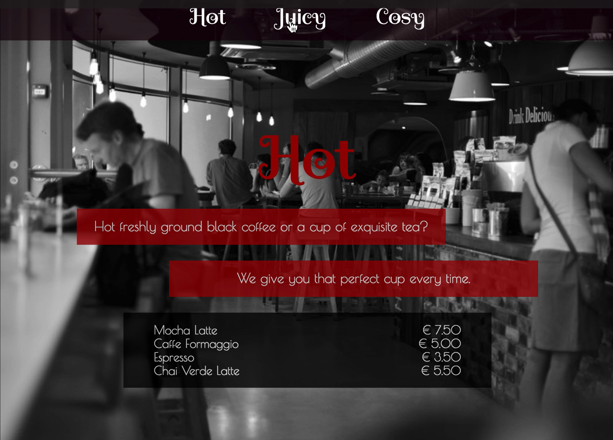

# Exercise React Caffe Retro

## Description

You are contacted by the advertising agency SkissaMera, who has produced a sketch of a website for a client – ​​a cafe called Caffe Retro.

<figure></figure>

## Scetch

The sketch is in the form of a video, "Caffe Retro sketch", and it shows a website consisting of a web page divided into three sections _( Hot, Juice and Cozy )_. Watch carefully, pausing to see details as you work.

You must imitate the sketch as much as you can. Do not use your own images and fonts, but use the attached material, follow the look in the video and the instructions in this exercise description. The built-in CSS color `darkred` is a good color for this exercise.

**The different images, fonts, texts and video are available in the asssets folder.**

## Intructions

- The website must have three sections.
- Every section should fill an entire window.
- Every section should have a header, texts and background images according to the scetch.
- There must be a menu with links to the different sections.
- Every background image should cover its entire section.
- The website should have as many semantic elements as possible.
- The menu should be fixed to the top of the window at all time.
- The website must be responsive. The video shows how it is supposed to look like.
- Take accessibility into account. 
